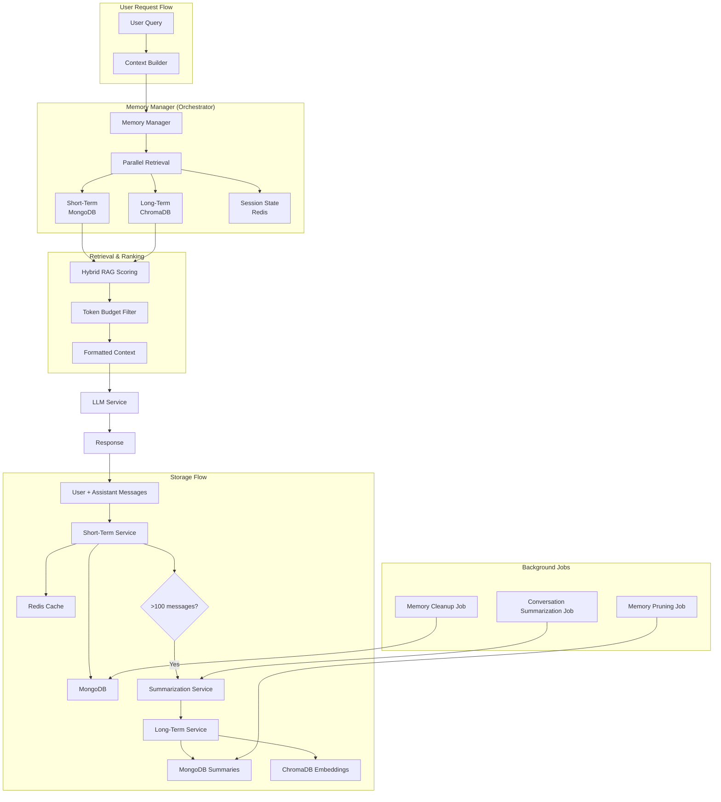
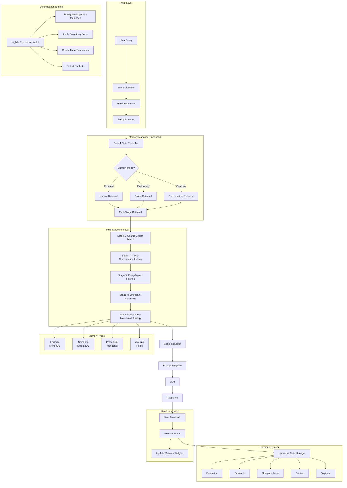
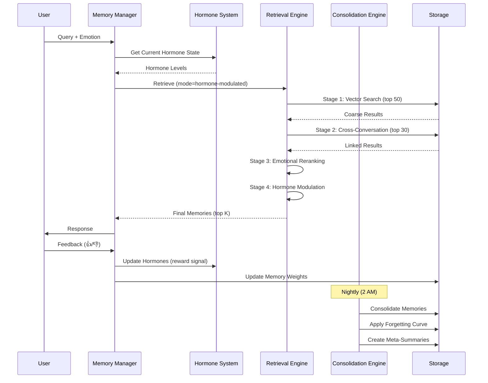
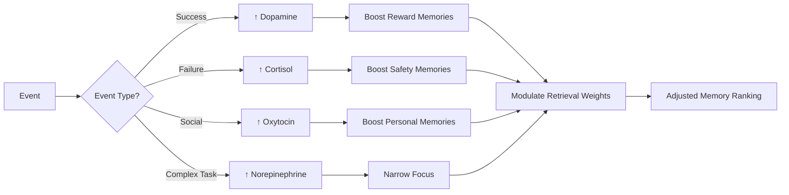

# Gnani Memory System - Comprehensive Technical Analysis Report

**Generated**: 2025-12-15  
**Scope**: Complete backend memory architecture analysis  
**Purpose**: Identify gaps, weaknesses, and improvement opportunities for human-like memory capabilities

---

## 1. Project Overview

### Technology Stack
- **Backend Framework**: Node.js + TypeScript + Express
- **Database**: MongoDB (conversation messages & summaries)
- **Vector Database**: ChromaDB (semantic search)
- **Cache Layer**: Redis (session state, working memory)
- **Embedding Service**: Text Embeddings Inference (TEI) - all-MiniLM-L6-v2 (384 dimensions)
- **LLM**: Ollama (gemma:2b) with failover support
- **Token Counting**: tiktoken (GPT-3.5-turbo encoding)

### Current Memory Architecture Summary
Gnani implements a **3-tier memory system**:
1. **Short-term Memory** (MongoDB) - Recent conversation messages (30-day retention)
2. **Long-term Memory** (ChromaDB + MongoDB) - Summarized conversations with vector embeddings
3. **Working Memory** (Redis) - Active session state and cached messages (1-hour TTL)

---

## 2. Stack Understanding (Backend + Frontend)

### Backend Components
```
src/modules/memory/
├── memory.manager.ts              # Central orchestrator
├── services/
│   ├── short-term-memory.service.ts   # MongoDB CRUD for messages
│   ├── long-term-memory.service.ts    # Summary creation & embedding storage
│   ├── session-memory.service.ts      # Redis caching
│   └── memory-scorer.service.ts       # Importance scoring & pruning
├── entities/
│   ├── conversation.entity.ts         # Message schema
│   └── conversation-summary.entity.ts # Summary schema
├── rag-pipeline.service.ts        # RAG retrieval & reranking
├── cross-conversation-memory.service.ts # Related conversation linking
├── summarization.service.ts       # LLM-based summarization
├── decay-calculator.ts            # Time-based decay
├── self-adjuster.ts               # Dynamic weight adjustment
├── budget-calculator.ts           # Adaptive token budgeting
└── performance-tracker.ts         # Memory system metrics
```

### Integration Points
- **Context Builder** (`context.builder.ts`) - Calls `memoryManager.getContextForPrompt()`
- **LLM Service** (`llm.service.ts`) - Uses formatted context for prompt construction
- **Vector Manager** (`vector.manager.ts`) - Manages ChromaDB + TEI embeddings
- **Background Jobs** - `memory-cleanup.job.ts`, `memory-pruning.job.ts`, `conversation-summarization.job.ts`

---

## 3. Full File-by-File Analysis

### 3.1 Core Memory Manager (`memory.manager.ts`)

**Purpose**: Central orchestrator for all memory operations

**Key Functions**:
- `getContextForPrompt()` - Main entry point, retrieves short-term + long-term memories
- `storeInteraction()` - Saves user/assistant message pairs
- `rankMemoriesHybridRAG()` - Scores memories using semantic + recency + keyword matching
- `applyTokenBudget()` - Filters memories to fit token budget using tiktoken
- `checkAndTriggerSummarization()` - Background summarization trigger

**Strengths**:
✅ Parallel retrieval (short-term, long-term, session state)  
✅ Hybrid RAG scoring (semantic 40%, recency 40%, keywords 20%)  
✅ Adaptive token budgeting based on query complexity  
✅ Automatic summarization trigger (>100 messages)  
✅ Accurate token counting with tiktoken  
✅ Dynamic weight adjustment via `self-adjuster`  
✅ Time-based decay via `decay-calculator`

**Critical Weaknesses**:
❌ **No memory type classification** - All memories treated uniformly (no episodic vs semantic vs procedural)  
❌ **No emotional/sentiment tagging** - Cannot store mood, tone, or emotional context  
❌ **No reward signals** - No reinforcement learning or importance boosting based on outcomes  
❌ **Shallow semantic similarity** - Uses Jaccard similarity (word overlap) instead of true embedding-based cosine similarity  
❌ **No consolidation rules** - No sleep-like memory consolidation or forgetting mechanisms  
❌ **No global state controller** - Cannot switch between different memory modes (focused, exploratory, etc.)  
❌ **Missing metadata** - No user feedback, importance ratings, or access patterns tracked  
❌ **No cross-conversation linking in retrieval** - `cross-conversation-memory.service.ts` exists but not integrated into main flow

---

### 3.2 Short-Term Memory Service (`short-term-memory.service.ts`)

**Purpose**: CRUD operations for recent conversation messages in MongoDB

**Schema** (`conversation.entity.ts`):
```typescript
{
  userId: string
  conversationId: string (sessionId)
  role: 'user' | 'assistant'
  content: string
  status: 'draft' | 'pending' | 'streaming' | 'completed' | 'failed' | 'stale' | 'cancelled'
  generationId: string (unique per generation)
  generationIndex: number (for multiple generations)
  parentMessageId: string (for branching)
  version: number (for edits)
  editHistory: Array<{version, content, editedAt, editedBy}>
  metadata: {intent, action, cacheHit, processingTime, ...}
  attachments: Array<{fileId, fileName, parsedContent, ...}>
  tokenUsage: {inputTokens, outputTokens, totalTokens, estimatedCost, model}
  timestamp: Date
  createdAt: Date
  deletedAt: Date (soft delete)
}
```

**Strengths**:
✅ Rich schema with streaming support, versioning, branching  
✅ TTL index for auto-deletion (30 days)  
✅ Automatic title generation trigger (after 3rd message)  
✅ Compound indexes for efficient queries  
✅ Soft delete support

**Weaknesses**:
❌ **No access count tracking** - Cannot identify frequently referenced memories  
❌ **No importance score** - All messages treated equally  
❌ **No emotional metadata** - No sentiment, mood, or tone  
❌ **No user feedback loop** - No thumbs up/down, ratings, or corrections  
❌ **No memory type field** - Cannot distinguish episodic vs semantic memories

---

### 3.3 Long-Term Memory Service (`long-term-memory.service.ts`)

**Purpose**: Create summaries and store embeddings in ChromaDB

**Schema** (`conversation-summary.entity.ts`):
```typescript
{
  userId: string
  conversationIds: string[]
  summary: string
  messageCount: number
  startTime: Date
  endTime: Date
  topics: string[]
  embeddingId: string (ChromaDB reference)
  embeddingStatus: 'pending' | 'processing' | 'completed' | 'failed'
  userRating: number (0-5)
  metadata: {intents, actions, messageIds, accessCount, relevanceScore}
  createdAt: Date
  updatedAt: Date
}
```

**Strengths**:
✅ LLM-based summarization with structured prompts  
✅ Topic extraction  
✅ User rating support (0-5 stars)  
✅ Embedding status tracking  
✅ Automatic pruning (keeps top 1000 memories)

**Weaknesses**:
❌ **No hierarchical summarization** - No summary-of-summaries for long-term consolidation  
❌ **No entity extraction** - Simple keyword extraction, no proper NER  
❌ **No relationship mapping** - Cannot link related concepts or entities  
❌ **No temporal clustering** - Summaries not organized by time periods  
❌ **No importance decay** - Old summaries not automatically downweighted  
❌ **No memory reinforcement** - Frequently accessed summaries not boosted

---

### 3.4 Session Memory Service (`session-memory.service.ts`)

**Purpose**: Redis-based working memory for active sessions

**Data Stored**:
- `session:{sessionId}:messages` - Cached recent messages (1-hour TTL)
- `session:{sessionId}:state` - Session state (userId, lastIntent, lastAction, isSpeaking, lastActivity)
- `user:{userId}:{key}` - User-specific cached data

**Strengths**:
✅ Fast Redis-based caching  
✅ Automatic TTL expiration  
✅ Session state tracking

**Weaknesses**:
❌ **No attention mechanism** - Cannot track what user is focused on  
❌ **No working memory limits** - No simulation of human working memory constraints (7±2 items)  
❌ **No priority queue** - All cached items treated equally  
❌ **No context switching support** - Cannot save/restore different mental states

---

### 3.5 Vector Manager (`vector.manager.ts`)

**Purpose**: Manage ChromaDB and TEI embedding generation

**Configuration**:
- **Embedding Model**: all-MiniLM-L6-v2 (384 dimensions)
- **Vector DB**: ChromaDB with HNSW index (cosine similarity)
- **HNSW Parameters**: `construction_ef=200`, `M=16`
- **Batch Processing**: Max 32 items, 50ms delay
- **Cache**: Redis cache for query results (1-hour TTL)

**Strengths**:
✅ Batch embedding generation  
✅ Circuit breaker for reliability  
✅ Query result caching  
✅ Timeout protection (2s for vector search)  
✅ Graceful degradation (returns empty on failure)

**Weaknesses**:
❌ **No multi-vector support** - Cannot store multiple embeddings per memory (e.g., content + summary + keywords)  
❌ **No dynamic embedding models** - Hardcoded to all-MiniLM-L6-v2  
❌ **No embedding versioning** - Cannot track which model version generated embeddings  
❌ **No metadata filtering** - Limited ChromaDB metadata queries  
❌ **No hybrid search** - No combination of vector + keyword search  
❌ **No reranking integration** - RAG pipeline has reranking but not used in main flow

---

### 3.6 RAG Pipeline Service (`rag-pipeline.service.ts`)

**Purpose**: Advanced RAG with retrieval, reranking, and deduplication

**Pipeline**:
1. Generate query embedding
2. Vector search (retrieve k*2 results)
3. Rerank using cosine similarity
4. Deduplicate
5. Return top K

**Strengths**:
✅ Reranking for better relevance  
✅ Deduplication  
✅ Cosine similarity for reranking

**Weaknesses**:
❌ **Not integrated into main memory flow** - Exists but not called by `memory.manager.ts`  
❌ **No query expansion** - No synonym expansion or query reformulation  
❌ **No multi-hop retrieval** - Cannot follow chains of related memories  
❌ **No contextual reranking** - Reranking doesn't consider conversation context

---

### 3.7 Cross-Conversation Memory Service (`cross-conversation-memory.service.ts`)

**Purpose**: Find related conversations using vector similarity

**Strengths**:
✅ Vector-based conversation linking  
✅ Shared topic extraction

**Weaknesses**:
❌ **Not integrated into main retrieval** - Exists but not used in `getContextForPrompt()`  
❌ **No temporal awareness** - Doesn't consider when conversations happened  
❌ **No user context** - Doesn't consider user's current goal or intent

---

### 3.8 Memory Scorer Service (`memory-scorer.service.ts`)

**Purpose**: Score memories for importance and prune low-value memories

**Scoring Formula** (0-100 points):
- **Recency**: 0-30 points (age in days)
- **Frequency**: 0-25 points (access count * 5, max 25)
- **Relevance**: 0-25 points (vector similarity)
- **User Rating**: 0-20 points (0-5 stars * 4)

**Strengths**:
✅ Multi-factor importance scoring  
✅ Automatic pruning (keeps top 1000)  
✅ User rating support

**Weaknesses**:
❌ **No reward signals** - Cannot boost memories based on successful outcomes  
❌ **No emotional weight** - Cannot prioritize emotionally significant memories  
❌ **No context-dependent scoring** - Score is static, not adjusted based on current query  
❌ **No forgetting curve** - Linear decay, not Ebbinghaus-style exponential forgetting

---

### 3.9 Summarization Service (`summarization.service.ts`)

**Purpose**: LLM-based conversation summarization

**Configuration**:
- **Trigger Threshold**: 20 messages
- **Min Messages**: 10
- **Keep Recent**: 5 messages

**Strengths**:
✅ LLM-powered intelligent summarization  
✅ Structured prompts with guidelines  
✅ Compression ratio tracking  
✅ Graceful fallback on errors

**Weaknesses**:
❌ **No incremental summarization** - Summarizes entire batch, not progressive  
❌ **No summary hierarchy** - No meta-summaries of summaries  
❌ **No entity preservation** - Important entities may be lost in summarization  
❌ **No user control** - Cannot specify what to emphasize in summaries

---

### 3.10 Decay Calculator (`decay-calculator.ts`)

**Purpose**: Apply time-based decay to memory scores

**Weaknesses**:
❌ **Linear decay assumption** - Not biologically realistic (should be exponential)  
❌ **No spaced repetition** - Cannot boost memories that are periodically accessed  
❌ **No consolidation simulation** - No sleep-like memory strengthening

---

### 3.11 Self-Adjuster (`self-adjuster.ts`)

**Purpose**: Dynamically adjust RAG scoring weights

**Weaknesses**:
❌ **No learning mechanism** - Weights are static, not learned from feedback  
❌ **No A/B testing** - Cannot experiment with different weight configurations  
❌ **No user-specific tuning** - Same weights for all users

---

### 3.12 Budget Calculator (`budget-calculator.ts`)

**Purpose**: Calculate adaptive token budgets based on query complexity

**Strengths**:
✅ Complexity-aware budgeting  
✅ Conversation depth consideration

**Weaknesses**:
❌ **No dynamic adjustment** - Budget not adjusted based on retrieval quality  
❌ **No user preferences** - Cannot let users control verbosity

---

## 4. Current Memory Architecture Diagram



---

## 5. Critical Weaknesses (Ranked by Impact)

### 🔴 **CRITICAL** (Blocks Human-Like Memory)

1. **No Memory Type Classification**
   - **Impact**: Cannot distinguish episodic (events), semantic (facts), procedural (skills)
   - **Current**: All memories are generic text blobs
   - **Needed**: Memory type field + type-specific retrieval strategies

2. **No Emotional/Sentiment Metadata**
   - **Impact**: Cannot recall emotionally significant moments or adjust tone based on past interactions
   - **Current**: No sentiment analysis, no mood tracking
   - **Needed**: Sentiment scores, emotional tags, user mood history

3. **No Reward Signals / Reinforcement**
   - **Impact**: Cannot learn which memories are actually useful
   - **Current**: Static importance scores
   - **Needed**: Feedback loop (thumbs up/down, task success/failure)

4. **Shallow Semantic Similarity**
   - **Impact**: Poor retrieval quality, misses semantically related memories
   - **Current**: Jaccard similarity (word overlap) in hybrid RAG
   - **Needed**: True embedding-based cosine similarity for all memories

5. **No Consolidation / Forgetting Rules**
   - **Impact**: Memory grows unbounded, no intelligent forgetting
   - **Current**: Simple pruning (keep top 1000), linear decay
   - **Needed**: Sleep-like consolidation, Ebbinghaus forgetting curve, spaced repetition

### 🟠 **HIGH** (Limits Effectiveness)

6. **No Global State Controller**
   - **Impact**: Cannot switch between focused/exploratory/creative modes
   - **Current**: Single retrieval strategy for all queries
   - **Needed**: State machine for different memory modes

7. **Missing Cross-Conversation Integration**
   - **Impact**: Cannot leverage related past conversations
   - **Current**: `cross-conversation-memory.service.ts` exists but not used
   - **Needed**: Integrate into main retrieval flow

8. **No Hierarchical Summarization**
   - **Impact**: Long-term memories become flat and hard to navigate
   - **Current**: Single-level summaries
   - **Needed**: Summary-of-summaries, temporal clustering

9. **No Multi-Vector Embeddings**
   - **Impact**: Single embedding per memory limits retrieval flexibility
   - **Current**: One embedding per summary
   - **Needed**: Multiple embeddings (content, summary, keywords, entities)

10. **No Access Pattern Tracking**
    - **Impact**: Cannot identify frequently referenced memories
    - **Current**: `accessCount` in metadata but not tracked
    - **Needed**: Increment access count on retrieval, use in scoring

### 🟡 **MEDIUM** (Reduces Quality)

11. **No Entity Extraction / Relationship Mapping**
    - **Impact**: Cannot answer "What did I say about X?" or "How is X related to Y?"
    - **Current**: Simple keyword extraction
    - **Needed**: Proper NER, entity linking, knowledge graph

12. **No Query Expansion**
    - **Impact**: Misses relevant memories due to vocabulary mismatch
    - **Current**: Exact query embedding
    - **Needed**: Synonym expansion, query reformulation

13. **No User Feedback Loop**
    - **Impact**: Cannot improve based on user corrections
    - **Current**: No thumbs up/down, no corrections
    - **Needed**: Feedback UI + storage + learning

14. **No Working Memory Simulation**
    - **Impact**: Doesn't mimic human attention limits
    - **Current**: Unlimited Redis cache
    - **Needed**: 7±2 item limit, priority queue, attention mechanism

15. **No Contextual Reranking**
    - **Impact**: Retrieval doesn't consider conversation flow
    - **Current**: Static reranking based on query alone
    - **Needed**: Conversation-aware reranking

---

## 6. Comparison vs ChatGPT/Gemini/Alexa

### ChatGPT Long-Term Memory
✅ **What ChatGPT Has**:
- User preferences stored across sessions
- Automatic fact extraction ("User prefers Python over JavaScript")
- Memory management UI (view/edit/delete memories)
- Contextual memory retrieval (only relevant memories surfaced)
- Explicit user control ("Remember this", "Forget that")

❌ **What Gnani Lacks**:
- No user preference extraction
- No memory management UI
- No explicit memory commands
- No fact-based memory (only conversation summaries)

### Gemini Personalized Memory
✅ **What Gemini Has**:
- Multi-turn context awareness
- User profile building over time
- Adaptive response style based on past interactions
- Cross-conversation learning

❌ **What Gnani Lacks**:
- No user profile building
- No adaptive response style
- Cross-conversation service exists but not integrated

### Alexa/Siri Contextual Memory
✅ **What Alexa/Siri Have**:
- Device-specific context (location, time, device state)
- Routine learning (morning routine, bedtime routine)
- Proactive suggestions based on patterns
- Voice profile recognition

❌ **What Gnani Lacks**:
- No routine learning
- No proactive suggestions
- No pattern recognition for habits

---

## 7. Gap Analysis for the 8 Memory Phases

### PHASE 1: Memory Types ❌ **NOT IMPLEMENTED**

**Required**:
- Episodic Memory (events, conversations)
- Semantic Memory (facts, knowledge)
- Procedural Memory (how-to, skills)
- Working Memory (current context)

**Current State**:
- All memories are generic text
- No type field in schema
- No type-specific retrieval

**Action Items**:
1. Add `memoryType` field to schemas
2. Implement type-specific scoring
3. Create type-specific retrieval strategies
4. Add UI for memory type filtering

---

### PHASE 2: Memory Schema (Future-Proof for Hormones) ⚠️ **PARTIALLY IMPLEMENTED**

**Required**:
- Emotional tone/sentiment
- Importance weight (modifiable)
- Reward signal
- Access count
- Recency decay factor
- Consolidation status

**Current State**:
✅ `userRating` (0-5) in summaries  
✅ `metadata` field (extensible)  
✅ `timestamp` for recency  
❌ No sentiment/emotion  
❌ No reward signal  
❌ No consolidation status  
❌ `accessCount` in metadata but not tracked

**Action Items**:
1. Add `sentiment` field (positive/negative/neutral, -1 to +1)
2. Add `emotionalIntensity` (0-1)
3. Add `rewardSignal` (success/failure/neutral)
4. Add `consolidationLevel` (0-1, increases with each consolidation)
5. Track `accessCount` on every retrieval
6. Add `importanceWeight` (modifiable by hormones)

---

### PHASE 3: Memory Consolidation Rules ❌ **NOT IMPLEMENTED**

**Required**:
- Sleep-like consolidation (periodic background process)
- Ebbinghaus forgetting curve
- Spaced repetition for important memories
- Hierarchical summarization (summaries of summaries)
- Interference handling (conflicting memories)

**Current State**:
✅ Automatic summarization (>100 messages)  
✅ Simple pruning (keep top 1000)  
❌ No sleep-like consolidation  
❌ Linear decay, not exponential  
❌ No spaced repetition  
❌ No hierarchical summaries  
❌ No interference detection

**Action Items**:
1. Implement nightly consolidation job (2 AM)
   - Strengthen frequently accessed memories
   - Weaken rarely accessed memories
   - Create meta-summaries
2. Replace linear decay with exponential forgetting curve
3. Implement spaced repetition algorithm (SM-2 or similar)
4. Add conflict detection for contradictory memories
5. Create summary hierarchy (daily → weekly → monthly)

---

### PHASE 4: Composite Retrieval Layer ⚠️ **PARTIALLY IMPLEMENTED**

**Required**:
- Multi-stage retrieval (coarse → fine)
- Hybrid search (vector + keyword + metadata)
- Cross-conversation linking
- Entity-based retrieval
- Temporal filtering
- Reranking with conversation context

**Current State**:
✅ Hybrid RAG (semantic + recency + keywords)  
✅ Vector search via ChromaDB  
✅ Cross-conversation service exists  
❌ Not multi-stage  
❌ No entity-based retrieval  
❌ No temporal filtering  
❌ Cross-conversation not integrated  
❌ Reranking not conversation-aware

**Action Items**:
1. Integrate `cross-conversation-memory.service.ts` into main flow
2. Add entity extraction and entity-based retrieval
3. Add temporal filters (last week, last month, etc.)
4. Implement multi-stage retrieval:
   - Stage 1: Coarse vector search (top 50)
   - Stage 2: Rerank with conversation context (top 20)
   - Stage 3: Fine-grained scoring with all factors (top K)
5. Add metadata filtering (memory type, sentiment, importance)

---

### PHASE 5: Prompt Builder Enforcement ⚠️ **PARTIALLY IMPLEMENTED**

**Required**:
- Structured prompt templates
- Memory injection points clearly defined
- Token budget enforcement
- Memory type segregation in prompt
- Metadata inclusion (when, why, importance)

**Current State**:
✅ Token budget enforcement via tiktoken  
✅ Context builder integrates memory  
✅ Adaptive budgeting based on complexity  
❌ No structured prompt templates for memory  
❌ No memory type segregation  
❌ No metadata in prompt (just content)

**Action Items**:
1. Create prompt template with sections:
   ```
   ## Recent Conversation (Episodic)
   [short-term messages]
   
   ## Relevant Knowledge (Semantic)
   [long-term facts]
   
   ## Related Past Conversations
   [cross-conversation context]
   
   ## User Preferences
   [extracted preferences]
   ```
2. Include metadata in prompt (timestamp, importance, sentiment)
3. Add memory provenance ("From conversation on 2025-12-10")

---

### PHASE 6: UI Debug Memory Mode ❌ **NOT IMPLEMENTED**

**Required**:
- Memory inspector UI
- Show retrieved memories with scores
- Explain why each memory was selected
- Allow manual memory editing
- Memory search interface
- Memory deletion/archiving

**Current State**:
❌ No memory UI at all  
❌ No memory inspection  
❌ No explainability

**Action Items**:
1. Create `/api/memory/debug` endpoint
   - Return retrieved memories with scores
   - Include retrieval reasoning
2. Add frontend memory inspector panel
3. Add memory search UI
4. Add memory edit/delete UI
5. Add memory importance adjustment UI

---

### PHASE 7: Redis Working Memory ⚠️ **PARTIALLY IMPLEMENTED**

**Required**:
- Attention mechanism (what user is focused on)
- Working memory limits (7±2 items)
- Priority queue for important items
- Context switching (save/restore mental state)
- Short-term buffer (last N interactions)

**Current State**:
✅ Redis caching for session messages  
✅ Session state tracking  
❌ No attention mechanism  
❌ No working memory limits  
❌ No priority queue  
❌ No context switching

**Action Items**:
1. Implement attention tracking:
   - Track which entities/topics user is discussing
   - Boost retrieval for attended items
2. Add working memory limit (7±2 items in active focus)
3. Create priority queue for important items
4. Add context switching:
   - Save current mental state on session pause
   - Restore on session resume
5. Add "mental workspace" concept (current task, goals, constraints)

---

### PHASE 8: Hormone-Compatible Architecture ❌ **NOT IMPLEMENTED**

**Required**:
- Modifiable weights (for dopamine, serotonin, etc.)
- Emotional tone storage
- Reward signal tracking
- Recency/importance decay (modifiable)
- Retrieval bias shifting
- Global context state switching
- Adaptive behavior changes

**Current State**:
✅ Dynamic weights via `self-adjuster` (but not hormone-based)  
✅ Decay calculator (but linear, not modifiable)  
❌ No emotional tone  
❌ No reward signals  
❌ No hormone system  
❌ No retrieval bias shifting  
❌ No global state controller

**Action Items**:
1. Design hormone system:
   - **Dopamine**: Boost reward-associated memories
   - **Serotonin**: Adjust patience, verbosity
   - **Norepinephrine**: Increase focus, reduce distractions
   - **Cortisol**: Prioritize safety, caution
   - **Oxytocin**: Boost social/personal memories
2. Add hormone levels to session state
3. Modify retrieval weights based on hormone levels
4. Add hormone triggers (success → dopamine, failure → cortisol)
5. Create hormone decay over time
6. Add hormone-based response style adjustment

---

## 8. Future-Proofing Analysis for Hormone Layer

### Can Current Architecture Support Hormones?

**✅ YES** (with modifications):
- Schema is extensible (metadata field)
- Weights are already dynamic (`self-adjuster`)
- Scoring is multi-factor (can add hormone modulation)
- Session state can store hormone levels

**❌ NO** (missing critical components):
- No emotional tone storage
- No reward signal tracking
- No global state controller
- No retrieval bias mechanism
- No adaptive behavior system

### Required Additions for Hormone Support

#### 1. Hormone State Manager
```typescript
interface HormoneState {
  dopamine: number;      // 0-1 (reward, motivation)
  serotonin: number;     // 0-1 (mood, patience)
  norepinephrine: number; // 0-1 (alertness, focus)
  cortisol: number;      // 0-1 (stress, caution)
  oxytocin: number;      // 0-1 (social bonding)
  lastUpdated: Date;
}
```

#### 2. Hormone-Modulated Retrieval
```typescript
function modulateRetrievalWeights(baseWeights, hormones) {
  return {
    semantic: baseWeights.semantic * (1 + hormones.norepinephrine * 0.3),
    recency: baseWeights.recency * (1 + hormones.dopamine * 0.2),
    emotional: baseWeights.emotional * (1 + hormones.oxytocin * 0.5),
    importance: baseWeights.importance * (1 + hormones.cortisol * 0.3)
  };
}
```

#### 3. Reward Signal Integration
```typescript
interface RewardSignal {
  messageId: string;
  signal: 'success' | 'failure' | 'neutral';
  intensity: number; // 0-1
  timestamp: Date;
}

function applyRewardSignal(memory, reward) {
  // Boost dopamine on success
  if (reward.signal === 'success') {
    hormoneState.dopamine = Math.min(1, hormoneState.dopamine + 0.1 * reward.intensity);
    memory.importanceWeight *= (1 + 0.5 * reward.intensity);
  }
  // Increase cortisol on failure
  else if (reward.signal === 'failure') {
    hormoneState.cortisol = Math.min(1, hormoneState.cortisol + 0.1 * reward.intensity);
  }
}
```

#### 4. Emotional Memory Tagging
```typescript
interface EmotionalMetadata {
  sentiment: number;        // -1 (negative) to +1 (positive)
  emotionalIntensity: number; // 0-1
  emotionalTags: string[];  // ['joy', 'frustration', 'curiosity']
  userMood: number;         // -1 to +1 (at time of interaction)
}
```

#### 5. Global State Controller
```typescript
enum MemoryMode {
  FOCUSED,      // High norepinephrine, narrow retrieval
  EXPLORATORY,  // High dopamine, broad retrieval
  CAUTIOUS,     // High cortisol, conservative retrieval
  SOCIAL,       // High oxytocin, personal memory focus
  CREATIVE      // Balanced hormones, diverse retrieval
}

function switchMemoryMode(mode: MemoryMode) {
  switch(mode) {
    case FOCUSED:
      hormoneState.norepinephrine = 0.8;
      retrievalStrategy = 'narrow';
      break;
    case EXPLORATORY:
      hormoneState.dopamine = 0.8;
      retrievalStrategy = 'broad';
      break;
    // ... other modes
  }
}
```

---

## 9. Proposed New Architecture (Diagrams + Flow)

### 9.1 Enhanced Memory Architecture



### 9.2 Memory Lifecycle Flow



### 9.3 Hormone Modulation Flow



---

## 10. Migration Plan with Milestones

### Milestone 1: Foundation (Weeks 1-2)
**Goal**: Add missing schema fields and basic tracking

**Tasks**:
1. Add `memoryType` field to conversation and summary schemas
2. Add `sentiment`, `emotionalIntensity`, `emotionalTags` fields
3. Add `accessCount` tracking (increment on retrieval)
4. Add `rewardSignal` field
5. Add `consolidationLevel` field
6. Create migration script for existing data

**Deliverables**:
- Updated schemas
- Migration script
- Unit tests for new fields

---

### Milestone 2: Memory Type Classification (Weeks 3-4)
**Goal**: Implement memory type detection and type-specific retrieval

**Tasks**:
1. Create memory type classifier (rule-based + ML)
   - Episodic: Conversations, events
   - Semantic: Facts, knowledge
   - Procedural: How-to, instructions
2. Implement type-specific scoring
3. Add type filtering to retrieval
4. Update prompt builder to segregate by type

**Deliverables**:
- Memory type classifier
- Type-specific retrieval strategies
- Updated prompt templates

---

### Milestone 3: Emotional Intelligence (Weeks 5-6)
**Goal**: Add sentiment analysis and emotional memory tagging

**Tasks**:
1. Integrate sentiment analysis (use existing NLP library)
2. Tag all incoming messages with sentiment
3. Add emotional reranking to retrieval
4. Track user mood over time
5. Create emotion-based memory filters

**Deliverables**:
- Sentiment analysis integration
- Emotional memory tagging
- Mood tracking dashboard

---

### Milestone 4: Reward Signals & Feedback Loop (Weeks 7-8)
**Goal**: Implement user feedback and reward-based learning

**Tasks**:
1. Add thumbs up/down UI to responses
2. Create reward signal storage
3. Implement reward-based memory boosting
4. Add feedback analytics dashboard
5. Create feedback-based weight adjustment

**Deliverables**:
- Feedback UI
- Reward signal tracking
- Memory weight adjustment algorithm

---

### Milestone 5: Advanced Retrieval (Weeks 9-10)
**Goal**: Implement multi-stage retrieval and cross-conversation linking

**Tasks**:
1. Integrate `cross-conversation-memory.service.ts` into main flow
2. Implement multi-stage retrieval pipeline
3. Add entity extraction (use spaCy or similar)
4. Add entity-based retrieval
5. Add temporal filtering
6. Implement conversation-aware reranking

**Deliverables**:
- Multi-stage retrieval pipeline
- Entity extraction service
- Cross-conversation integration

---

### Milestone 6: Memory Consolidation (Weeks 11-12)
**Goal**: Implement sleep-like consolidation and forgetting

**Tasks**:
1. Create nightly consolidation job
2. Implement Ebbinghaus forgetting curve
3. Add spaced repetition algorithm
4. Create hierarchical summarization (daily → weekly → monthly)
5. Add conflict detection for contradictory memories

**Deliverables**:
- Consolidation job
- Forgetting curve implementation
- Hierarchical summaries

---

### Milestone 7: Hormone System (Weeks 13-14)
**Goal**: Implement neuromodulatory meta-layer

**Tasks**:
1. Create hormone state manager
2. Add hormone levels to session state
3. Implement hormone triggers (success, failure, social, etc.)
4. Add hormone-modulated retrieval weights
5. Create global state controller (memory modes)
6. Add hormone decay over time

**Deliverables**:
- Hormone system
- Hormone-modulated retrieval
- Memory mode switching

---

### Milestone 8: UI & Debugging (Weeks 15-16)
**Goal**: Add memory inspection and management UI

**Tasks**:
1. Create memory inspector API endpoints
2. Build memory inspector UI
3. Add memory search interface
4. Add memory edit/delete UI
5. Add retrieval explainability (why this memory was selected)
6. Create memory analytics dashboard

**Deliverables**:
- Memory inspector UI
- Memory management interface
- Analytics dashboard

---

## 11. Exact Code-Level Changes (per file)

### 11.1 `conversation.entity.ts`

**Add Fields**:
```typescript
// Memory type classification
memoryType: 'episodic' | 'semantic' | 'procedural' | 'working'

// Emotional metadata
sentiment: number // -1 to +1
emotionalIntensity: number // 0 to 1
emotionalTags: string[] // ['joy', 'frustration', 'curiosity']
userMood: number // -1 to +1 (at time of interaction)

// Reward signals
rewardSignal: 'success' | 'failure' | 'neutral' | null
rewardIntensity: number // 0 to 1

// Access tracking
accessCount: number // Increment on retrieval
lastAccessedAt: Date

// Consolidation
consolidationLevel: number // 0 to 1
consolidatedAt: Date

// Importance (modifiable by hormones)
importanceWeight: number // 0 to 1
```

**Add Indexes**:
```typescript
conversationMessageSchema.index({ memoryType: 1, userId: 1 });
conversationMessageSchema.index({ sentiment: 1 });
conversationMessageSchema.index({ accessCount: -1 });
conversationMessageSchema.index({ importanceWeight: -1 });
```

---

### 11.2 `conversation-summary.entity.ts`

**Add Fields**:
```typescript
// Memory type
memoryType: 'episodic' | 'semantic'

// Emotional summary
averageSentiment: number
emotionalHighlights: string[]

// Hierarchical summarization
parentSummaryId: string // For meta-summaries
childSummaryIds: string[]
summaryLevel: number // 0=base, 1=daily, 2=weekly, 3=monthly

// Consolidation
consolidationLevel: number
lastConsolidatedAt: Date

// Entities
entities: Array<{
  name: string
  type: 'person' | 'place' | 'organization' | 'concept'
  mentions: number
}>

// Relationships
relatedSummaryIds: string[]
relatedEntities: string[]
```

---

### 11.3 `memory.manager.ts`

**Add Method**: `classifyMemoryType()`
```typescript
private classifyMemoryType(content: string, metadata: any): 'episodic' | 'semantic' | 'procedural' {
  // Rule-based classification
  if (metadata.intent === 'how_to' || content.includes('step 1') || content.includes('first,')) {
    return 'procedural';
  }
  if (content.includes('I') || content.includes('we') || content.includes('yesterday') || content.includes('last week')) {
    return 'episodic';
  }
  return 'semantic'; // Facts, knowledge
}
```

**Add Method**: `analyzeSentiment()`
```typescript
private async analyzeSentiment(content: string): Promise<{
  sentiment: number,
  intensity: number,
  tags: string[]
}> {
  // Use sentiment analysis library (e.g., sentiment, natural)
  // Return sentiment score, intensity, and emotional tags
}
```

**Modify**: `storeInteraction()`
```typescript
async storeInteraction(
  userId: string,
  sessionId: string,
  userMessage: string,
  assistantMessage: string,
  metadata: any = {}
): Promise<void> {
  // Classify memory type
  const memoryType = this.classifyMemoryType(userMessage, metadata);
  
  // Analyze sentiment
  const sentiment = await this.analyzeSentiment(userMessage);
  
  // Store with enhanced metadata
  await shortTermMemory.storeMessage(
    userId,
    sessionId,
    'user',
    userMessage,
    {
      ...metadata,
      memoryType,
      sentiment: sentiment.sentiment,
      emotionalIntensity: sentiment.intensity,
      emotionalTags: sentiment.tags,
      importanceWeight: 0.5, // Default
      accessCount: 0
    }
  );
  
  // ... rest of method
}
```

**Modify**: `rankMemoriesHybridRAG()`
```typescript
private rankMemoriesHybridRAG(
  shortTermMessages: any[],
  longTermMemories: string[],
  currentQuery: string,
  tokenBudget: number,
  hormoneState?: HormoneState // NEW
): RankedMemory[] {
  // Get base weights
  const baseWeights = selfAdjuster.getCurrentWeights();
  
  // Modulate weights with hormones
  const weights = hormoneState 
    ? this.modulateWeightsWithHormones(baseWeights, hormoneState)
    : baseWeights;
  
  // ... rest of ranking logic with modulated weights
}
```

**Add Method**: `modulateWeightsWithHormones()`
```typescript
private modulateWeightsWithHormones(
  baseWeights: any,
  hormones: HormoneState
): any {
  return {
    semantic: baseWeights.semantic * (1 + hormones.norepinephrine * 0.3),
    recency: baseWeights.recency * (1 + hormones.dopamine * 0.2),
    keywords: baseWeights.keywords,
    emotional: (baseWeights.emotional || 0.1) * (1 + hormones.oxytocin * 0.5),
    importance: (baseWeights.importance || 0.1) * (1 + hormones.cortisol * 0.3)
  };
}
```

**Add Method**: `trackMemoryAccess()`
```typescript
private async trackMemoryAccess(messageId: string): Promise<void> {
  await ConversationMessage.findByIdAndUpdate(messageId, {
    $inc: { accessCount: 1 },
    $set: { lastAccessedAt: new Date() }
  });
}
```

---

### 11.4 `session-memory.service.ts`

**Add Method**: `getHormoneState()`
```typescript
async getHormoneState(sessionId: string): Promise<HormoneState | null> {
  const key = `session:${sessionId}:hormones`;
  const value = await redisClient.get(key);
  return value ? JSON.parse(value) : null;
}
```

**Add Method**: `updateHormoneState()`
```typescript
async updateHormoneState(
  sessionId: string,
  updates: Partial<HormoneState>
): Promise<void> {
  const current = await this.getHormoneState(sessionId) || {
    dopamine: 0.5,
    serotonin: 0.5,
    norepinephrine: 0.5,
    cortisol: 0.3,
    oxytocin: 0.5,
    lastUpdated: new Date()
  };
  
  const updated = {
    ...current,
    ...updates,
    lastUpdated: new Date()
  };
  
  const key = `session:${sessionId}:hormones`;
  await redisClient.setex(key, 3600, JSON.stringify(updated));
}
```

---

### 11.5 `long-term-memory.service.ts`

**Add Method**: `createMetaSummary()`
```typescript
async createMetaSummary(
  userId: string,
  summaryIds: string[],
  level: number
): Promise<IConversationSummary | null> {
  // Fetch child summaries
  const summaries = await ConversationSummary.find({
    _id: { $in: summaryIds }
  });
  
  // Combine summaries
  const combinedText = summaries.map(s => s.summary).join('\n\n');
  
  // Create meta-summary using LLM
  const metaSummary = await this.summarizeConversation(
    combinedText,
    userId
  );
  
  // Store meta-summary
  const summary = new ConversationSummary({
    userId,
    summary: metaSummary,
    summaryLevel: level,
    childSummaryIds: summaryIds,
    // ... other fields
  });
  
  await summary.save();
  return summary;
}
```

---

### 11.6 Create `hormone-manager.service.ts`

```typescript
import { createContextualLogger } from '../../core/logger/logger.js';
import sessionMemory from '../memory/services/session-memory.service.js';

interface HormoneState {
  dopamine: number;      // 0-1 (reward, motivation)
  serotonin: number;     // 0-1 (mood, patience)
  norepinephrine: number; // 0-1 (alertness, focus)
  cortisol: number;      // 0-1 (stress, caution)
  oxytocin: number;      // 0-1 (social bonding)
  lastUpdated: Date;
}

enum MemoryMode {
  FOCUSED = 'focused',
  EXPLORATORY = 'exploratory',
  CAUTIOUS = 'cautious',
  SOCIAL = 'social',
  CREATIVE = 'creative'
}

class HormoneManager {
  private logger = createContextualLogger({ module: 'HormoneManager' });
  
  async applyRewardSignal(
    sessionId: string,
    signal: 'success' | 'failure' | 'neutral',
    intensity: number
  ): Promise<void> {
    const current = await sessionMemory.getHormoneState(sessionId);
    if (!current) return;
    
    if (signal === 'success') {
      await sessionMemory.updateHormoneState(sessionId, {
        dopamine: Math.min(1, current.dopamine + 0.1 * intensity)
      });
    } else if (signal === 'failure') {
      await sessionMemory.updateHormoneState(sessionId, {
        cortisol: Math.min(1, current.cortisol + 0.1 * intensity)
      });
    }
  }
  
  async switchMode(sessionId: string, mode: MemoryMode): Promise<void> {
    const updates: Partial<HormoneState> = {};
    
    switch(mode) {
      case MemoryMode.FOCUSED:
        updates.norepinephrine = 0.8;
        break;
      case MemoryMode.EXPLORATORY:
        updates.dopamine = 0.8;
        break;
      case MemoryMode.CAUTIOUS:
        updates.cortisol = 0.8;
        break;
      case MemoryMode.SOCIAL:
        updates.oxytocin = 0.8;
        break;
      case MemoryMode.CREATIVE:
        updates.dopamine = 0.6;
        updates.serotonin = 0.7;
        break;
    }
    
    await sessionMemory.updateHormoneState(sessionId, updates);
  }
  
  async applyDecay(sessionId: string): Promise<void> {
    const current = await sessionMemory.getHormoneState(sessionId);
    if (!current) return;
    
    const decayRate = 0.1; // 10% decay per hour
    const timeSinceUpdate = Date.now() - new Date(current.lastUpdated).getTime();
    const hoursSinceUpdate = timeSinceUpdate / (1000 * 60 * 60);
    
    await sessionMemory.updateHormoneState(sessionId, {
      dopamine: Math.max(0.3, current.dopamine - decayRate * hoursSinceUpdate),
      cortisol: Math.max(0.2, current.cortisol - decayRate * hoursSinceUpdate),
      norepinephrine: Math.max(0.3, current.norepinephrine - decayRate * hoursSinceUpdate)
    });
  }
}

export default new HormoneManager();
```

---

### 11.7 Create `consolidation.job.ts`

```typescript
import { createContextualLogger } from '../core/logger/logger.js';
import ConversationSummary from '../modules/memory/entities/conversation-summary.entity.js';
import ConversationMessage from '../modules/memory/entities/conversation.entity.js';
import longTermMemory from '../modules/memory/services/long-term-memory.service.js';

class ConsolidationJob {
  private logger = createContextualLogger({ module: 'ConsolidationJob' });
  
  async run(): Promise<void> {
    this.logger.info('Starting nightly consolidation...');
    
    // 1. Strengthen frequently accessed memories
    await this.strengthenImportantMemories();
    
    // 2. Apply forgetting curve
    await this.applyForgettingCurve();
    
    // 3. Create meta-summaries
    await this.createMetaSummaries();
    
    // 4. Detect conflicts
    await this.detectConflicts();
    
    this.logger.info('Consolidation complete.');
  }
  
  private async strengthenImportantMemories(): Promise<void> {
    // Find messages with high access count
    const messages = await ConversationMessage.find({
      accessCount: { $gte: 5 }
    });
    
    for (const msg of messages) {
      await ConversationMessage.findByIdAndUpdate(msg._id, {
        $set: {
          consolidationLevel: Math.min(1, (msg.consolidationLevel || 0) + 0.1),
          importanceWeight: Math.min(1, (msg.importanceWeight || 0.5) + 0.05)
        }
      });
    }
    
    this.logger.info(`Strengthened ${messages.length} memories`);
  }
  
  private async applyForgettingCurve(): Promise<void> {
    // Ebbinghaus forgetting curve: R = e^(-t/S)
    // R = retention, t = time, S = strength
    
    const messages = await ConversationMessage.find({});
    
    for (const msg of messages) {
      const ageInDays = (Date.now() - new Date(msg.createdAt).getTime()) / (1000 * 60 * 60 * 24);
      const strength = msg.consolidationLevel || 0.5;
      const retention = Math.exp(-ageInDays / (strength * 30)); // 30-day baseline
      
      await ConversationMessage.findByIdAndUpdate(msg._id, {
        $set: {
          importanceWeight: Math.max(0.1, (msg.importanceWeight || 0.5) * retention)
        }
      });
    }
    
    this.logger.info('Applied forgetting curve to all memories');
  }
  
  private async createMetaSummaries(): Promise<void> {
    // Create daily summaries from hourly summaries
    // Create weekly summaries from daily summaries
    // etc.
    
    const yesterday = new Date();
    yesterday.setDate(yesterday.getDate() - 1);
    yesterday.setHours(0, 0, 0, 0);
    
    const today = new Date();
    today.setHours(0, 0, 0, 0);
    
    // Find all summaries from yesterday
    const dailySummaries = await ConversationSummary.find({
      createdAt: { $gte: yesterday, $lt: today },
      summaryLevel: 0 // Base level
    });
    
    if (dailySummaries.length > 0) {
      // Create meta-summary for yesterday
      await longTermMemory.createMetaSummary(
        dailySummaries[0].userId,
        dailySummaries.map(s => s._id.toString()),
        1 // Daily level
      );
    }
    
    this.logger.info('Created meta-summaries');
  }
  
  private async detectConflicts(): Promise<void> {
    // Detect contradictory memories
    // This is a placeholder - would need semantic similarity + contradiction detection
    this.logger.info('Conflict detection not yet implemented');
  }
  
  schedule(): void {
    // Run daily at 2 AM
    const runDaily = () => {
      const now = new Date();
      const next2AM = new Date(
        now.getFullYear(),
        now.getMonth(),
        now.getDate() + 1,
        2, 0, 0, 0
      );
      const timeUntil2AM = next2AM.getTime() - now.getTime();
      
      setTimeout(() => {
        this.run();
        runDaily();
      }, timeUntil2AM);
    };
    
    runDaily();
    this.logger.info('Consolidation job scheduled for 2 AM daily');
  }
}

export default new ConsolidationJob();
```

---

## 12. Final Recommendations

### Immediate Actions (Next 2 Weeks)
1. ✅ **Add missing schema fields** (memoryType, sentiment, accessCount, rewardSignal)
2. ✅ **Implement memory type classification** (episodic, semantic, procedural)
3. ✅ **Add sentiment analysis** to all incoming messages
4. ✅ **Track access counts** on retrieval
5. ✅ **Integrate cross-conversation linking** into main retrieval flow

### Short-Term (1-2 Months)
6. ✅ **Implement multi-stage retrieval** (coarse → fine)
7. ✅ **Add entity extraction** and entity-based retrieval
8. ✅ **Create feedback UI** (thumbs up/down)
9. ✅ **Implement reward-based memory boosting**
10. ✅ **Add nightly consolidation job**

### Medium-Term (3-4 Months)
11. ✅ **Implement hormone system** (dopamine, serotonin, etc.)
12. ✅ **Add hierarchical summarization** (daily → weekly → monthly)
13. ✅ **Create memory inspector UI**
14. ✅ **Implement Ebbinghaus forgetting curve**
15. ✅ **Add spaced repetition algorithm**

### Long-Term (6+ Months)
16. ✅ **Build knowledge graph** from entities and relationships
17. ✅ **Implement multi-hop reasoning** over memory graph
18. ✅ **Add proactive memory suggestions** ("You might want to remember...")
19. ✅ **Create user preference extraction** (like ChatGPT)
20. ✅ **Implement adaptive response style** based on user history

---

## Summary

Gnani has a **solid foundation** for a memory system with:
- ✅ 3-tier architecture (short-term, long-term, working memory)
- ✅ Hybrid RAG scoring
- ✅ Automatic summarization
- ✅ Vector embeddings
- ✅ Redis caching

However, it **lacks critical components** for human-like memory:
- ❌ No memory type classification
- ❌ No emotional intelligence
- ❌ No reward signals / reinforcement learning
- ❌ No consolidation / forgetting mechanisms
- ❌ No hormone-based modulation
- ❌ No global state controller
- ❌ No user feedback loop
- ❌ No memory management UI

**To achieve ChatGPT/Gemini-level memory**, Gnani needs:
1. **Memory type classification** (episodic, semantic, procedural)
2. **Emotional tagging** (sentiment, mood, intensity)
3. **Reward-based learning** (feedback loop, importance boosting)
4. **Consolidation engine** (nightly job, forgetting curve, meta-summaries)
5. **Hormone system** (neuromodulatory meta-layer for adaptive behavior)
6. **Multi-stage retrieval** (coarse → fine, cross-conversation, entity-based)
7. **Memory UI** (inspector, search, edit, delete, explainability)

**Estimated Effort**: 16 weeks (4 months) for full implementation with 1-2 developers.

---

**End of Report**
